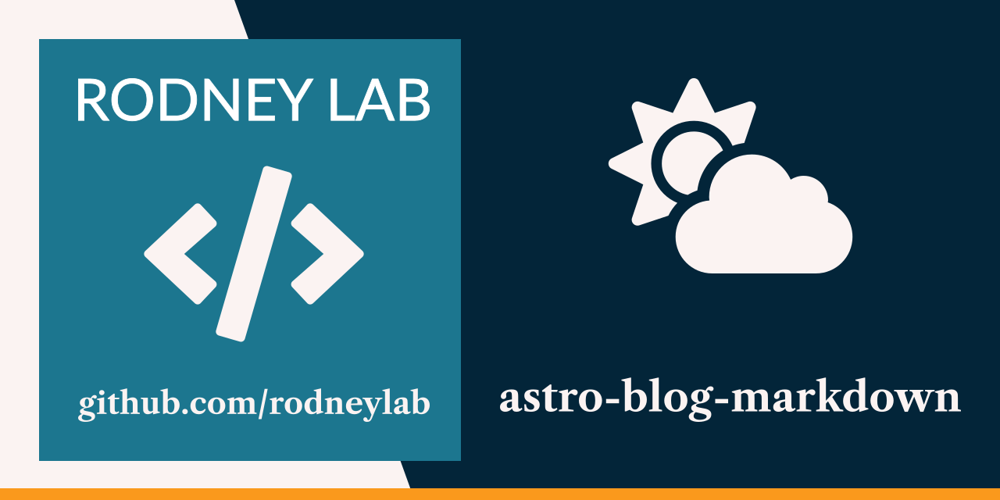
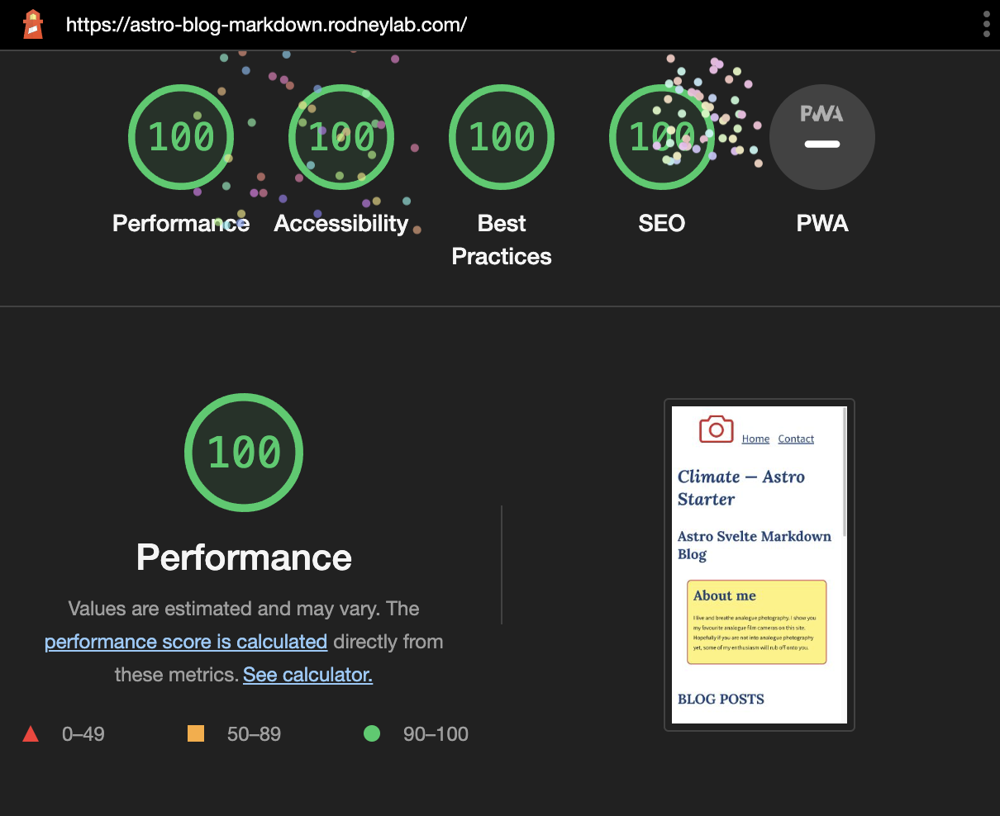

<p align="center">
  <a aria-label="Open Rodney Lab site" href="https://rodneylab.com" rel="nofollow noopener noreferrer">
    
  </a>
</p>
<h1 align="center">
  Astro Blog Markdown
</h1>

# astro-blog-markdown

[](https://stackblitz.com/github/rodneylab/astro-blog-markdown)

[](https://app.netlify.com/sites/jazzy-pixie-b363bf/deploys)

Starter for accessible, fast and SEO friendly Astro blog using a spot of Svelte. See post on <a aria-label="Open article on using the Astro blog starter" href="https://rodneylab.com/astro-blog-markdown/">how to get up and running on the Astro blog starter</a>.



# Astro Blog Markdown

```
git clone https://github.com/rodneylab/astro-blog-markdown
cd astro-blog-markdown
pnpm install
cp .env.EXAMPLE .env
pnpm run dev
```

## 🧞 Commands

All commands are run from the root of the project, from a terminal:

| Command                        | Action                                       |
| :----------------------------- | :------------------------------------------- |
| `pnpm install`                 | Installs dependencies                        |
| `pnpm astro telemetry disable` | Disable data collection                      |
| `pnpm run dev`                 | Starts local dev server at `localhost:3000`  |
| `pnpm run build`               | Build your production site to `./dist/`      |
| `pnpm run preview`             | Preview your build locally, before deploying |

Feel free to jump into the [Rodney Lab matrix chat room](https://matrix.to/#/%23rodney:matrix.org).
